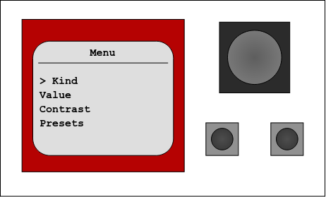

# FRPico
The FRPico is based on the description from Carnegie Mellon University's 36-218 (Probability for Computer Scientists) course. The source code is heavily based on Professor Genovese's `frplib`, which can be found [here](https://github.com/genovese/frplib).

## FRPs
FRPs (Fixed Random Payoffs) are boxes that model _random variables_. A full description can be found in [chapter 0](https://github.com/genovese/frplib/blob/main/docs/chapter0-draft.pdf) of the 36-218 textbook. The following image is the theoretical model of the FRP from the textbook:


An FRP can be "observed" when the red button is pressed. The LED lights up to indicate that it has been observed, and its value is fixed -- it cannot be reobserved. The value an FRP displays depends on its _kind_, a tree where leaves correspond to potential outputs and branches are weighted by their value's probability.

The input and output ports allow FRPs to be chained. When an FRP observes a value, it can pass its result through its output port to the input port of another FRP. The chaining of FRPs, described in the textbook, is referred to as a _mixture_.

A _conditional FRP_ allows the value of one FRP to affect the value of another. The mixture of an FRP R and a conditional FRP M creates an FRP where the value from R influences which values from M appear, and with what probability.

The FRPico supports a subset of the FRP's functionality. It can select from a variety of hardcoded kinds and conditional kinds, and custom kinds can also be uploaded to the FRPico through hardcoding. In particular, the FRPico supports observing an FRP and the chaining of an FRP and multiple conditional FRPs, allowing for the visualization how FRPs influence each other. However, the only mixture operation it supports is the conditioning operator (//).

## Usage
The FRPico has two main modes: _Value_ and _Kind_. By default, it is in Kind mode, and displays the ASCII tree representation of the FRPico's kind.

Below is a diagram of the FRPico's face. 



- To observe the FRPico, press the **left button**.
- To open the menu, press the **right button**.
- To scroll, move the **joystick** (top).
- To select a menu option, press the **joystick** until it clicks.

The FRPico's menu has four options:
- **Kind** mode displays the kind (general or conditional) of the FRPico.
- **Value** mode displays the observed value, if the FRPico has been observed.
- **Contrast** mode allows the user to adjust the contrast of the LCD screen. If the text is not visible, the contrast should be raised; if the entire screen is black, the contrast should be lowered.
- **Presets** allow the user to select from several kinds and conditional kinds. Conditional kinds can be selected by choosing the bottommost kind in the presets menu.

When selecting a **conditional kind**, the FRPico will request a range of values. Then, for each value, it will request a general kind. This constructs a conditional kind where a potential received value maps to a specific general kind; for example, the following conditional kind will give a value from 1-6 with uniform probability if it receives a 1, and a value from 1-2 with uniform probability if it receives a 2.

```
    ,- 1/6 - 1 
    |- 1/6 - 2 
    |- 1/6 - 3 
1: -|          
    |- 1/6 - 4 
    |- 1/6 - 5 
    `- 1/6 - 6 
               
    ,- 1/2 - 1 
2: -|          
    `- 1/2 - 2   
```

Each FRPico has an input cable and an output cable. The input cable is characterized by a female connector, and is much shorter. The output cable has a male connector and is very long.

To pipe the output of an FRPico (FRPico 1) to another (FRPico 2), connect the _output_ cable of FRPico 1 to the _input_ cable of FRPico 2. Upon observing FRPico 1, the value should be transmitted to FRPico 2. If the value is in FRPico 2's conditional kind, it will update according to the chosen kind.

**Note**: If the FRPico does not display any visible text, or if the FRPico's text is obfuscated by a black box, adjust the contrast in the menu. The former means you should raise the contrast, the latter means you should lower it.